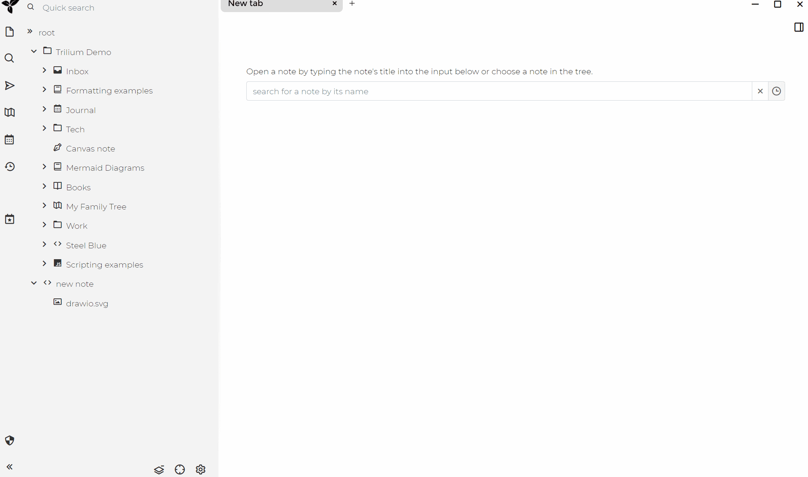

# trilium-drawio
## version: 0.4 for trilium > 0.62.4
## update
1. Fixed the bug where large files can only be displayed after refreshing when they are closed
2. Use light theme by default
## Draw.io is a JavaScript, client-side editor for general diagramming and whiteboarding. **This widget allows you to use drawio drawing in trilium.**
## Installation
1. Create a code note of type JS Frontend with the contents of `trilium-drawio.js` and the label `#widget`
2. Import `drawio.svg` into Notes and add `#template` tag to it
3. Reload frontend
## Tips
1. The saved format is svg
2. Click on the svg image to enter the editing state
3. Will call the drawio website
## Preview

