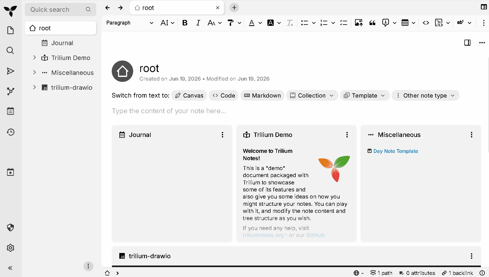

# trilium-drawio
## version: 0.7 for trilium > 0.104.0
## Update
1. Most of the widget’s logic has been rewritten to adapt to the latest version of Trilium. Several potential bugs have also been fixed, resulting in improved stability and reliability.

## Draw.io is a editor for general diagramming and whiteboarding. **This widget allows you to use drawio drawing in trilium.**

## Two Installation Methods

### Method 1
1. Create a code note of type **JS Frontend**, paste the contents of `trilium-drawio.js` into it, and add the `#widget` tag  
2. Import `DrawioTemplate.svg` into Notes and assign it the `#template` tag  
3. Reload the frontend  

### Method 2
Directly download the latest `trilium-drawio.zip` from the [Releases page](https://github.com/SiriusXT/trilium-drawio/releases) 

Then import it into Trilium. Note: **you do not need to enable secure import**.

## Tips
1. The saved format is svg
2. Click on the svg image to enter the editing state
3. Will call the drawio website. Default is official hosted version; can be self-hosted

## FAQ
**Q1: Does removing or disabling the widget mean my Draw.io notes are lost?**

**A1:** No. Draw.io diagrams are stored as SVG files inside Trilium. Even if you remove this widget, your Draw.io notes will remain fully usable. You can even open them via **Advanced → Open note externally** and edit them using a locally installed Draw.io desktop application, without relying on this widget at all.

**Q2: Why can’t I export to PDF using Draw.io’s built-in export feature?**

**A2:** This is because the official hosted Draw.io instance does not include export services by default. To enable PDF export, you need to self-host Draw.io along with the export backend services.
Please refer to:
[https://github.com/jgraph/docker-drawio](https://github.com/jgraph/docker-drawio)
and the self-contained deployment example:
[https://github.com/jgraph/docker-drawio/blob/dev/self-contained/docker-compose.yml](https://github.com/jgraph/docker-drawio/blob/dev/self-contained/docker-compose.yml)

## Preview

